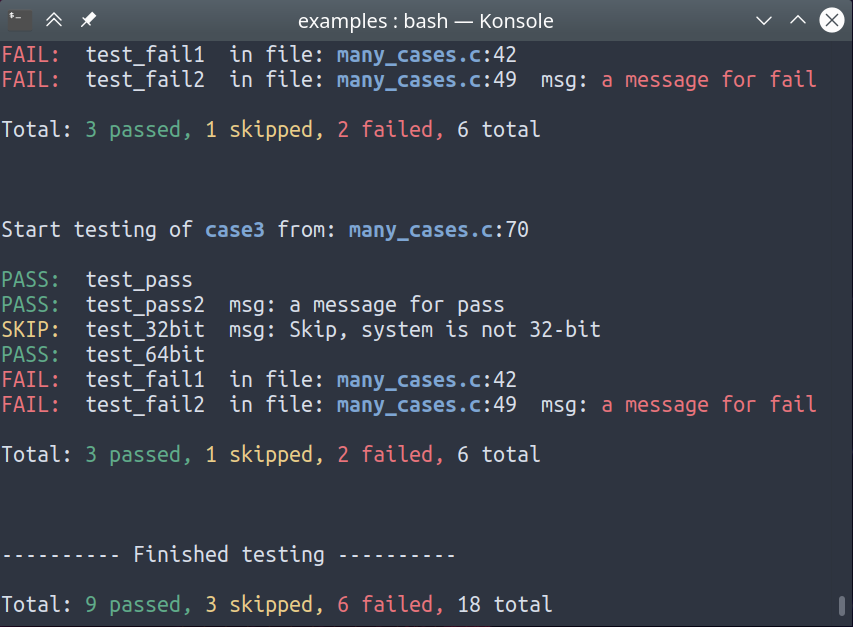

# STest - is simple unit tests for C/C++

## Description

STest is simple unit tests for C/C++.

</img>

### Features:

* The code uses only the standard C99 This allows you to use the STest in the oldest projects with older compilers.
* The code has no dependencies, and imprisoned in the one file.
* Support simple (single) tests.
* Support case(s) of tests.
* Support `init` and `clean` functions for test in case.
* Support three levels (`PASS`, `SKIP`, `FAIL`)
* Support macro `ASSERT` and `STATIC_ASSERT`
* Support macro `stest_printf` - for select print function in embeded system
* Support color in console (optional) see [stest.h](./stest.h)

## Usage

#### To start working, perform the following steps:

1. You need to include [stest.h](./stest.h) file in your .c/.cpp file.
2. Use the macro `TEST(name)` to write test.
3. Use the macros `TEST_PASS(msg)`, `TEST_SKIP(msg)`, `TEST_FAIL(msg)` for exit from test.
4. Or use the macros `TEST_ASSERT(expr)`, `TEST_ASSERT2(expr, msg)`
5. Use the macro `MAIN_*` for declare function `main`, or directly use the `run_case(s)` function in embeded system.
6. Compile and run test.

> Note:
  STest uses the standard clib `printf` function from stdio.h.
  If you are using STest on an embedded system perhaps you have your own
  function or less resource-intensive one like [xprintf](http://elm-chan.org/fsw/strf/xprintf.html)
  Then uncomment the definition `stest_ptintf` and add your function.
  The function must have signature like `printf` and must support printing for formats: %s %d %u

## License

[BSD-3-Clause](./LICENSE).

## Copyright
Copyright (C) 2017 Koynov Stas - skojnov@yandex.ru
